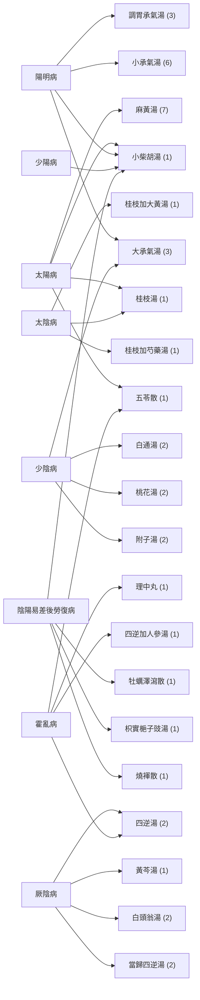

```mermaid
graph LR
  taiyang["太陽病"]
  taiyang --> f186["桂枝湯 (21)"]
  taiyang --> f7395["小柴胡湯 (13)"]
  taiyang --> f8305["麻黃湯 (7)"]
  taiyang --> f2637["五苓散 (6)"]
  yangming["陽明病"]
  yangming --> f6453["大承氣湯 (16)"]
  yangming --> f3896["小承氣湯 (6)"]
  yangming --> f983["調胃承氣湯 (3)"]
  yangming --> f7395["小柴胡湯 (3)"]
  shaoyang["少陽病"]
  shaoyang --> f7395["小柴胡湯 (2)"]
  taiyin["太陰病"]
  taiyin --> f186["桂枝湯 (1)"]
  taiyin --> f1264["桂枝加芍藥湯 (1)"]
  taiyin --> f3080["桂枝加大黃湯 (1)"]
  shaoyin["少陰病"]
  shaoyin --> f6453["大承氣湯 (3)"]
  shaoyin --> f8688["附子湯 (2)"]
  shaoyin --> f3526["桃花湯 (2)"]
  shaoyin --> f1954["白通湯 (2)"]
  jueyin["厥陰病"]
  jueyin --> f4369["四逆湯 (4)"]
  jueyin --> f5282["當歸四逆湯 (2)"]
  jueyin --> f8551["白頭翁湯 (2)"]
  jueyin --> f3411["黃芩湯 (1)"]
  huoluan["霍亂病"]
  huoluan --> f4369["四逆湯 (2)"]
  huoluan --> f9734["四逆加人參湯 (1)"]
  huoluan --> f6210["理中丸 (1)"]
  huoluan --> f2637["五苓散 (1)"]
  laofu["陰陽易差後勞復病"]
  laofu --> f2726["燒褌散 (1)"]
  laofu --> f4264["枳實梔子豉湯 (1)"]
  laofu --> f7395["小柴胡湯 (1)"]
  laofu --> f9802["牡蠣澤瀉散 (1)"]
```