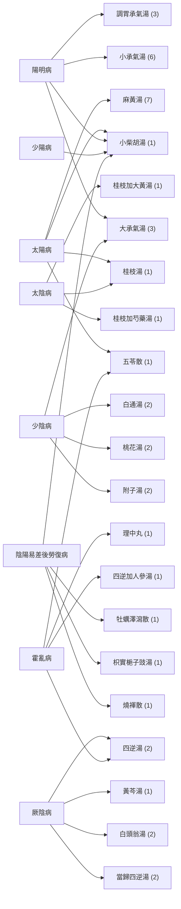

```mermaid
graph LR
  taiyang["太陽病"]
  taiyang --> f1357["桂枝湯 (21)"]
  taiyang --> f1426["小柴胡湯 (13)"]
  taiyang --> f7789["麻黃湯 (7)"]
  taiyang --> f1762["五苓散 (6)"]
  yangming["陽明病"]
  yangming --> f9472["大承氣湯 (16)"]
  yangming --> f7921["小承氣湯 (6)"]
  yangming --> f1652["調胃承氣湯 (3)"]
  yangming --> f1426["小柴胡湯 (3)"]
  shaoyang["少陽病"]
  shaoyang --> f1426["小柴胡湯 (2)"]
  taiyin["太陰病"]
  taiyin --> f1357["桂枝湯 (1)"]
  taiyin --> f1487["桂枝加芍藥湯 (1)"]
  taiyin --> f2754["桂枝加大黃湯 (1)"]
  shaoyin["少陰病"]
  shaoyin --> f9472["大承氣湯 (3)"]
  shaoyin --> f8314["附子湯 (2)"]
  shaoyin --> f972["桃花湯 (2)"]
  shaoyin --> f1292["白通湯 (2)"]
  jueyin["厥陰病"]
  jueyin --> f8677["四逆湯 (4)"]
  jueyin --> f3057["當歸四逆湯 (2)"]
  jueyin --> f4080["白頭翁湯 (2)"]
  jueyin --> f9713["黃芩湯 (1)"]
  huoluan["霍亂病"]
  huoluan --> f8677["四逆湯 (2)"]
  huoluan --> f3586["四逆加人參湯 (1)"]
  huoluan --> f6850["理中丸 (1)"]
  huoluan --> f1762["五苓散 (1)"]
  laofu["陰陽易差後勞復病"]
  laofu --> f990["燒褌散 (1)"]
  laofu --> f805["枳實梔子豉湯 (1)"]
  laofu --> f1426["小柴胡湯 (1)"]
  laofu --> f1578["牡蠣澤瀉散 (1)"]
```