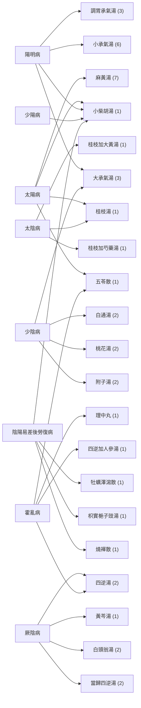

```mermaid
graph LR
  taiyang["太陽病"]
  taiyang --> f_a07aacaf6cbc["桂枝湯 (21)"]
  taiyang --> f_35eccc128bf6["小柴胡湯 (13)"]
  taiyang --> f_a8800c6c19ef["麻黃湯 (7)"]
  taiyang --> f_14b0e5ac442f["五苓散 (6)"]
  yangming["陽明病"]
  yangming --> f_47a916a6ab43["大承氣湯 (16)"]
  yangming --> f_a5fb292f4f6d["小承氣湯 (6)"]
  yangming --> f_a065d3558c9f["調胃承氣湯 (3)"]
  yangming --> f_35eccc128bf6["小柴胡湯 (3)"]
  shaoyang["少陽病"]
  shaoyang --> f_35eccc128bf6["小柴胡湯 (2)"]
  taiyin["太陰病"]
  taiyin --> f_a07aacaf6cbc["桂枝湯 (1)"]
  taiyin --> f_330970952de4["桂枝加芍藥湯 (1)"]
  taiyin --> f_dd9ecd91d4f8["桂枝加大黃湯 (1)"]
  shaoyin["少陰病"]
  shaoyin --> f_47a916a6ab43["大承氣湯 (3)"]
  shaoyin --> f_6bb6eb4a231d["附子湯 (2)"]
  shaoyin --> f_92a64b7004d6["桃花湯 (2)"]
  shaoyin --> f_beb4068b4870["白通湯 (2)"]
  jueyin["厥陰病"]
  jueyin --> f_43ff1f4e7be6["四逆湯 (4)"]
  jueyin --> f_751dfe5e1b40["當歸四逆湯 (2)"]
  jueyin --> f_22dd9d0165b2["白頭翁湯 (2)"]
  jueyin --> f_f2cc8988fc84["黃芩湯 (1)"]
  huoluan["霍亂病"]
  huoluan --> f_43ff1f4e7be6["四逆湯 (2)"]
  huoluan --> f_926ef188745e["四逆加人參湯 (1)"]
  huoluan --> f_f2a1a1314933["理中丸 (1)"]
  huoluan --> f_14b0e5ac442f["五苓散 (1)"]
  laofu["陰陽易差後勞復病"]
  laofu --> f_da234abfea69["燒褌散 (1)"]
  laofu --> f_e1241b331177["枳實梔子豉湯 (1)"]
  laofu --> f_35eccc128bf6["小柴胡湯 (1)"]
  laofu --> f_4ba7249aed94["牡蠣澤瀉散 (1)"]
```