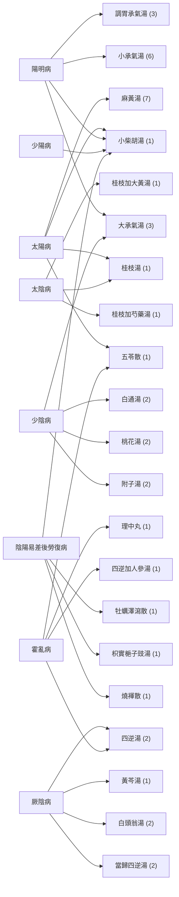

```mermaid
graph LR
  taiyang["太陽病"]
  taiyang --> f8575["桂枝湯 (21)"]
  taiyang --> f6480["小柴胡湯 (13)"]
  taiyang --> f1212["麻黃湯 (7)"]
  taiyang --> f4369["五苓散 (6)"]
  yangming["陽明病"]
  yangming --> f1538["大承氣湯 (16)"]
  yangming --> f8841["小承氣湯 (6)"]
  yangming --> f228["調胃承氣湯 (3)"]
  yangming --> f6480["小柴胡湯 (3)"]
  shaoyang["少陽病"]
  shaoyang --> f6480["小柴胡湯 (2)"]
  taiyin["太陰病"]
  taiyin --> f8575["桂枝湯 (1)"]
  taiyin --> f2887["桂枝加芍藥湯 (1)"]
  taiyin --> f2099["桂枝加大黃湯 (1)"]
  shaoyin["少陰病"]
  shaoyin --> f1538["大承氣湯 (3)"]
  shaoyin --> f630["附子湯 (2)"]
  shaoyin --> f7502["桃花湯 (2)"]
  shaoyin --> f19["白通湯 (2)"]
  jueyin["厥陰病"]
  jueyin --> f4376["四逆湯 (4)"]
  jueyin --> f8521["當歸四逆湯 (2)"]
  jueyin --> f5971["白頭翁湯 (2)"]
  jueyin --> f5632["黃芩湯 (1)"]
  huoluan["霍亂病"]
  huoluan --> f4376["四逆湯 (2)"]
  huoluan --> f3025["四逆加人參湯 (1)"]
  huoluan --> f4193["理中丸 (1)"]
  huoluan --> f4369["五苓散 (1)"]
  laofu["陰陽易差後勞復病"]
  laofu --> f1314["燒褌散 (1)"]
  laofu --> f9924["枳實梔子豉湯 (1)"]
  laofu --> f6480["小柴胡湯 (1)"]
  laofu --> f418["牡蠣澤瀉散 (1)"]
```