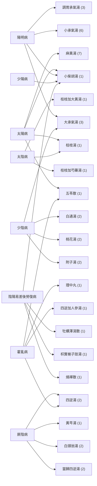

```mermaid
graph LR
  taiyang["太陽病"]
  taiyang --> f5399["桂枝湯 (21)"]
  taiyang --> f8468["小柴胡湯 (13)"]
  taiyang --> f6887["麻黃湯 (7)"]
  taiyang --> f7819["五苓散 (6)"]
  yangming["陽明病"]
  yangming --> f5605["大承氣湯 (16)"]
  yangming --> f2369["小承氣湯 (6)"]
  yangming --> f3714["調胃承氣湯 (3)"]
  yangming --> f8468["小柴胡湯 (3)"]
  shaoyang["少陽病"]
  shaoyang --> f8468["小柴胡湯 (2)"]
  taiyin["太陰病"]
  taiyin --> f5399["桂枝湯 (1)"]
  taiyin --> f6594["桂枝加芍藥湯 (1)"]
  taiyin --> f1657["桂枝加大黃湯 (1)"]
  shaoyin["少陰病"]
  shaoyin --> f5605["大承氣湯 (3)"]
  shaoyin --> f4516["附子湯 (2)"]
  shaoyin --> f6777["桃花湯 (2)"]
  shaoyin --> f9444["白通湯 (2)"]
  jueyin["厥陰病"]
  jueyin --> f1867["四逆湯 (4)"]
  jueyin --> f7988["當歸四逆湯 (2)"]
  jueyin --> f3304["白頭翁湯 (2)"]
  jueyin --> f2734["黃芩湯 (1)"]
  huoluan["霍亂病"]
  huoluan --> f1867["四逆湯 (2)"]
  huoluan --> f5689["四逆加人參湯 (1)"]
  huoluan --> f8922["理中丸 (1)"]
  huoluan --> f7819["五苓散 (1)"]
  laofu["陰陽易差後勞復病"]
  laofu --> f1404["燒褌散 (1)"]
  laofu --> f9033["枳實梔子豉湯 (1)"]
  laofu --> f8468["小柴胡湯 (1)"]
  laofu --> f8734["牡蠣澤瀉散 (1)"]
```