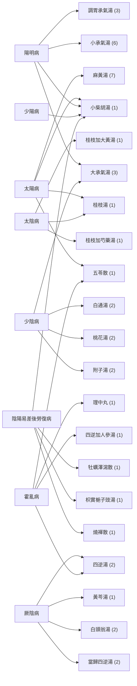

```mermaid
graph LR
  taiyang["太陽病"]
  taiyang --> f3779["桂枝湯 (21)"]
  taiyang --> f9037["小柴胡湯 (13)"]
  taiyang --> f9211["麻黃湯 (7)"]
  taiyang --> f3337["五苓散 (6)"]
  yangming["陽明病"]
  yangming --> f9187["大承氣湯 (16)"]
  yangming --> f3560["小承氣湯 (6)"]
  yangming --> f1111["調胃承氣湯 (3)"]
  yangming --> f9037["小柴胡湯 (3)"]
  shaoyang["少陽病"]
  shaoyang --> f9037["小柴胡湯 (2)"]
  taiyin["太陰病"]
  taiyin --> f3779["桂枝湯 (1)"]
  taiyin --> f1596["桂枝加芍藥湯 (1)"]
  taiyin --> f8378["桂枝加大黃湯 (1)"]
  shaoyin["少陰病"]
  shaoyin --> f9187["大承氣湯 (3)"]
  shaoyin --> f9336["附子湯 (2)"]
  shaoyin --> f4047["桃花湯 (2)"]
  shaoyin --> f5368["白通湯 (2)"]
  jueyin["厥陰病"]
  jueyin --> f3253["四逆湯 (4)"]
  jueyin --> f6611["當歸四逆湯 (2)"]
  jueyin --> f2530["白頭翁湯 (2)"]
  jueyin --> f3582["黃芩湯 (1)"]
  huoluan["霍亂病"]
  huoluan --> f3253["四逆湯 (2)"]
  huoluan --> f6121["四逆加人參湯 (1)"]
  huoluan --> f8739["理中丸 (1)"]
  huoluan --> f3337["五苓散 (1)"]
  laofu["陰陽易差後勞復病"]
  laofu --> f2416["燒褌散 (1)"]
  laofu --> f611["枳實梔子豉湯 (1)"]
  laofu --> f9037["小柴胡湯 (1)"]
  laofu --> f8283["牡蠣澤瀉散 (1)"]
```