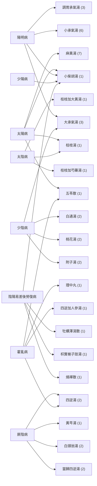

```mermaid
graph LR
  taiyang["太陽病"]
  taiyang --> f6617["桂枝湯 (21)"]
  taiyang --> f7251["小柴胡湯 (13)"]
  taiyang --> f5878["麻黃湯 (7)"]
  taiyang --> f5217["五苓散 (6)"]
  yangming["陽明病"]
  yangming --> f1823["大承氣湯 (16)"]
  yangming --> f4378["小承氣湯 (6)"]
  yangming --> f7616["調胃承氣湯 (3)"]
  yangming --> f7251["小柴胡湯 (3)"]
  shaoyang["少陽病"]
  shaoyang --> f7251["小柴胡湯 (2)"]
  taiyin["太陰病"]
  taiyin --> f6617["桂枝湯 (1)"]
  taiyin --> f1302["桂枝加芍藥湯 (1)"]
  taiyin --> f881["桂枝加大黃湯 (1)"]
  shaoyin["少陰病"]
  shaoyin --> f1823["大承氣湯 (3)"]
  shaoyin --> f3606["附子湯 (2)"]
  shaoyin --> f7052["桃花湯 (2)"]
  shaoyin --> f969["白通湯 (2)"]
  jueyin["厥陰病"]
  jueyin --> f4006["四逆湯 (4)"]
  jueyin --> f3956["當歸四逆湯 (2)"]
  jueyin --> f3655["白頭翁湯 (2)"]
  jueyin --> f6267["黃芩湯 (1)"]
  huoluan["霍亂病"]
  huoluan --> f4006["四逆湯 (2)"]
  huoluan --> f7259["四逆加人參湯 (1)"]
  huoluan --> f2992["理中丸 (1)"]
  huoluan --> f5217["五苓散 (1)"]
  laofu["陰陽易差後勞復病"]
  laofu --> f1779["燒褌散 (1)"]
  laofu --> f5957["枳實梔子豉湯 (1)"]
  laofu --> f7251["小柴胡湯 (1)"]
  laofu --> f3959["牡蠣澤瀉散 (1)"]
```