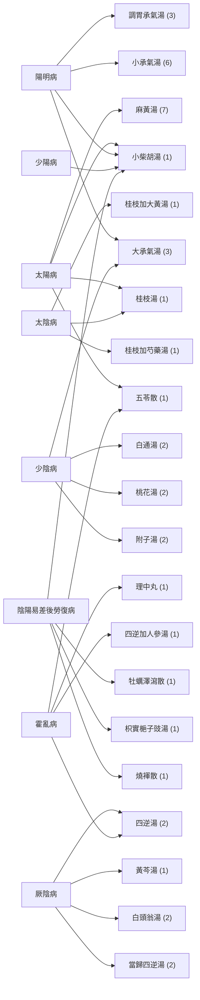

```mermaid
graph LR
  taiyang["太陽病"]
  taiyang --> f9259["桂枝湯 (21)"]
  taiyang --> f8186["小柴胡湯 (13)"]
  taiyang --> f5297["麻黃湯 (7)"]
  taiyang --> f4431["五苓散 (6)"]
  yangming["陽明病"]
  yangming --> f3435["大承氣湯 (16)"]
  yangming --> f1452["小承氣湯 (6)"]
  yangming --> f7551["調胃承氣湯 (3)"]
  yangming --> f8186["小柴胡湯 (3)"]
  shaoyang["少陽病"]
  shaoyang --> f8186["小柴胡湯 (2)"]
  taiyin["太陰病"]
  taiyin --> f9259["桂枝湯 (1)"]
  taiyin --> f9518["桂枝加芍藥湯 (1)"]
  taiyin --> f96["桂枝加大黃湯 (1)"]
  shaoyin["少陰病"]
  shaoyin --> f3435["大承氣湯 (3)"]
  shaoyin --> f183["附子湯 (2)"]
  shaoyin --> f3440["桃花湯 (2)"]
  shaoyin --> f6954["白通湯 (2)"]
  jueyin["厥陰病"]
  jueyin --> f7511["四逆湯 (4)"]
  jueyin --> f6177["當歸四逆湯 (2)"]
  jueyin --> f5083["白頭翁湯 (2)"]
  jueyin --> f976["黃芩湯 (1)"]
  huoluan["霍亂病"]
  huoluan --> f7511["四逆湯 (2)"]
  huoluan --> f4880["四逆加人參湯 (1)"]
  huoluan --> f7823["理中丸 (1)"]
  huoluan --> f4431["五苓散 (1)"]
  laofu["陰陽易差後勞復病"]
  laofu --> f8893["燒褌散 (1)"]
  laofu --> f3692["枳實梔子豉湯 (1)"]
  laofu --> f8186["小柴胡湯 (1)"]
  laofu --> f784["牡蠣澤瀉散 (1)"]
```