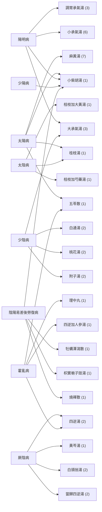

```mermaid
graph LR
  taiyang["太陽病"]
  taiyang --> f9453["桂枝湯 (21)"]
  taiyang --> f7591["小柴胡湯 (13)"]
  taiyang --> f910["麻黃湯 (7)"]
  taiyang --> f4277["五苓散 (6)"]
  yangming["陽明病"]
  yangming --> f9425["大承氣湯 (16)"]
  yangming --> f8767["小承氣湯 (6)"]
  yangming --> f6060["調胃承氣湯 (3)"]
  yangming --> f7591["小柴胡湯 (3)"]
  shaoyang["少陽病"]
  shaoyang --> f7591["小柴胡湯 (2)"]
  taiyin["太陰病"]
  taiyin --> f9453["桂枝湯 (1)"]
  taiyin --> f2607["桂枝加芍藥湯 (1)"]
  taiyin --> f8880["桂枝加大黃湯 (1)"]
  shaoyin["少陰病"]
  shaoyin --> f9425["大承氣湯 (3)"]
  shaoyin --> f3862["附子湯 (2)"]
  shaoyin --> f9195["桃花湯 (2)"]
  shaoyin --> f8917["白通湯 (2)"]
  jueyin["厥陰病"]
  jueyin --> f9108["四逆湯 (4)"]
  jueyin --> f9775["當歸四逆湯 (2)"]
  jueyin --> f5715["白頭翁湯 (2)"]
  jueyin --> f6624["黃芩湯 (1)"]
  huoluan["霍亂病"]
  huoluan --> f9108["四逆湯 (2)"]
  huoluan --> f717["四逆加人參湯 (1)"]
  huoluan --> f8918["理中丸 (1)"]
  huoluan --> f4277["五苓散 (1)"]
  laofu["陰陽易差後勞復病"]
  laofu --> f4961["燒褌散 (1)"]
  laofu --> f8621["枳實梔子豉湯 (1)"]
  laofu --> f7591["小柴胡湯 (1)"]
  laofu --> f8165["牡蠣澤瀉散 (1)"]
```