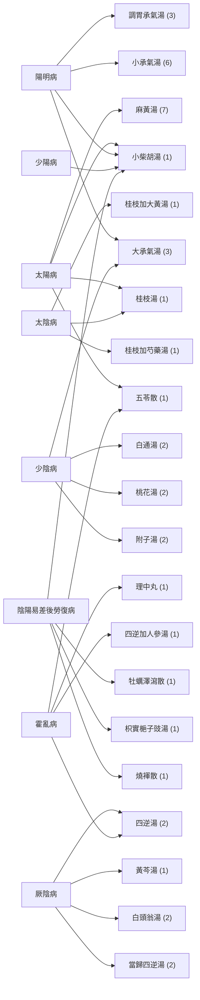

```mermaid
graph LR
  taiyang["太陽病"]
  taiyang --> f9428["桂枝湯 (21)"]
  taiyang --> f8841["小柴胡湯 (13)"]
  taiyang --> f1530["麻黃湯 (7)"]
  taiyang --> f3587["五苓散 (6)"]
  yangming["陽明病"]
  yangming --> f7947["大承氣湯 (16)"]
  yangming --> f522["小承氣湯 (6)"]
  yangming --> f3344["調胃承氣湯 (3)"]
  yangming --> f8841["小柴胡湯 (3)"]
  shaoyang["少陽病"]
  shaoyang --> f8841["小柴胡湯 (2)"]
  taiyin["太陰病"]
  taiyin --> f9428["桂枝湯 (1)"]
  taiyin --> f7788["桂枝加芍藥湯 (1)"]
  taiyin --> f806["桂枝加大黃湯 (1)"]
  shaoyin["少陰病"]
  shaoyin --> f7947["大承氣湯 (3)"]
  shaoyin --> f3569["附子湯 (2)"]
  shaoyin --> f4031["桃花湯 (2)"]
  shaoyin --> f8501["白通湯 (2)"]
  jueyin["厥陰病"]
  jueyin --> f8461["四逆湯 (4)"]
  jueyin --> f9117["當歸四逆湯 (2)"]
  jueyin --> f6543["白頭翁湯 (2)"]
  jueyin --> f3679["黃芩湯 (1)"]
  huoluan["霍亂病"]
  huoluan --> f8461["四逆湯 (2)"]
  huoluan --> f3903["四逆加人參湯 (1)"]
  huoluan --> f9216["理中丸 (1)"]
  huoluan --> f3587["五苓散 (1)"]
  laofu["陰陽易差後勞復病"]
  laofu --> f4015["燒褌散 (1)"]
  laofu --> f1220["枳實梔子豉湯 (1)"]
  laofu --> f8841["小柴胡湯 (1)"]
  laofu --> f7545["牡蠣澤瀉散 (1)"]
```