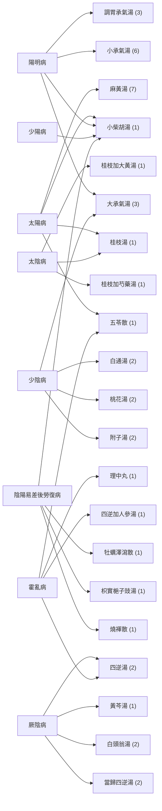

```mermaid
graph LR
  taiyang["太陽病"]
  taiyang --> f4996["桂枝湯 (21)"]
  taiyang --> f7918["小柴胡湯 (13)"]
  taiyang --> f4512["麻黃湯 (7)"]
  taiyang --> f6703["五苓散 (6)"]
  yangming["陽明病"]
  yangming --> f4467["大承氣湯 (16)"]
  yangming --> f3553["小承氣湯 (6)"]
  yangming --> f2832["調胃承氣湯 (3)"]
  yangming --> f7918["小柴胡湯 (3)"]
  shaoyang["少陽病"]
  shaoyang --> f7918["小柴胡湯 (2)"]
  taiyin["太陰病"]
  taiyin --> f4996["桂枝湯 (1)"]
  taiyin --> f3406["桂枝加芍藥湯 (1)"]
  taiyin --> f7170["桂枝加大黃湯 (1)"]
  shaoyin["少陰病"]
  shaoyin --> f4467["大承氣湯 (3)"]
  shaoyin --> f387["附子湯 (2)"]
  shaoyin --> f5160["桃花湯 (2)"]
  shaoyin --> f6533["白通湯 (2)"]
  jueyin["厥陰病"]
  jueyin --> f6505["四逆湯 (4)"]
  jueyin --> f3013["當歸四逆湯 (2)"]
  jueyin --> f9626["白頭翁湯 (2)"]
  jueyin --> f2825["黃芩湯 (1)"]
  huoluan["霍亂病"]
  huoluan --> f6505["四逆湯 (2)"]
  huoluan --> f4323["四逆加人參湯 (1)"]
  huoluan --> f5497["理中丸 (1)"]
  huoluan --> f6703["五苓散 (1)"]
  laofu["陰陽易差後勞復病"]
  laofu --> f4137["燒褌散 (1)"]
  laofu --> f8607["枳實梔子豉湯 (1)"]
  laofu --> f7918["小柴胡湯 (1)"]
  laofu --> f7080["牡蠣澤瀉散 (1)"]
```