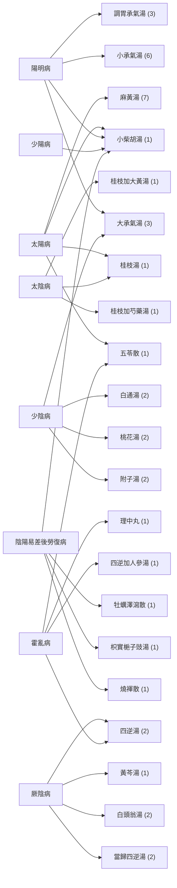

```mermaid
graph LR
  taiyang["太陽病"]
  taiyang --> f1385["桂枝湯 (21)"]
  taiyang --> f1227["小柴胡湯 (13)"]
  taiyang --> f4534["麻黃湯 (7)"]
  taiyang --> f4580["五苓散 (6)"]
  yangming["陽明病"]
  yangming --> f3788["大承氣湯 (16)"]
  yangming --> f2268["小承氣湯 (6)"]
  yangming --> f6813["調胃承氣湯 (3)"]
  yangming --> f1227["小柴胡湯 (3)"]
  shaoyang["少陽病"]
  shaoyang --> f1227["小柴胡湯 (2)"]
  taiyin["太陰病"]
  taiyin --> f1385["桂枝湯 (1)"]
  taiyin --> f7402["桂枝加芍藥湯 (1)"]
  taiyin --> f6607["桂枝加大黃湯 (1)"]
  shaoyin["少陰病"]
  shaoyin --> f3788["大承氣湯 (3)"]
  shaoyin --> f4760["附子湯 (2)"]
  shaoyin --> f8370["桃花湯 (2)"]
  shaoyin --> f8519["白通湯 (2)"]
  jueyin["厥陰病"]
  jueyin --> f1962["四逆湯 (4)"]
  jueyin --> f1172["當歸四逆湯 (2)"]
  jueyin --> f1930["白頭翁湯 (2)"]
  jueyin --> f8307["黃芩湯 (1)"]
  huoluan["霍亂病"]
  huoluan --> f1962["四逆湯 (2)"]
  huoluan --> f275["四逆加人參湯 (1)"]
  huoluan --> f4640["理中丸 (1)"]
  huoluan --> f4580["五苓散 (1)"]
  laofu["陰陽易差後勞復病"]
  laofu --> f7417["燒褌散 (1)"]
  laofu --> f6426["枳實梔子豉湯 (1)"]
  laofu --> f1227["小柴胡湯 (1)"]
  laofu --> f5151["牡蠣澤瀉散 (1)"]
```