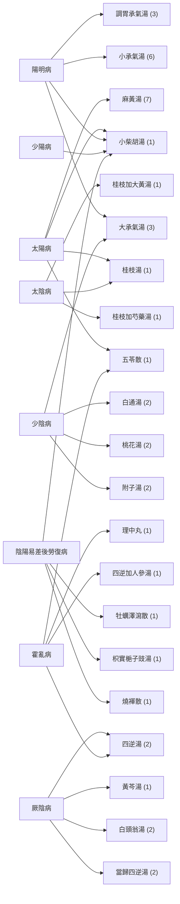

```mermaid
graph LR
  taiyang["太陽病"]
  taiyang --> f7274["桂枝湯 (21)"]
  taiyang --> f3355["小柴胡湯 (13)"]
  taiyang --> f8163["麻黃湯 (7)"]
  taiyang --> f653["五苓散 (6)"]
  yangming["陽明病"]
  yangming --> f7886["大承氣湯 (16)"]
  yangming --> f7463["小承氣湯 (6)"]
  yangming --> f6760["調胃承氣湯 (3)"]
  yangming --> f3355["小柴胡湯 (3)"]
  shaoyang["少陽病"]
  shaoyang --> f3355["小柴胡湯 (2)"]
  taiyin["太陰病"]
  taiyin --> f7274["桂枝湯 (1)"]
  taiyin --> f1489["桂枝加芍藥湯 (1)"]
  taiyin --> f7374["桂枝加大黃湯 (1)"]
  shaoyin["少陰病"]
  shaoyin --> f7886["大承氣湯 (3)"]
  shaoyin --> f6770["附子湯 (2)"]
  shaoyin --> f3503["桃花湯 (2)"]
  shaoyin --> f3464["白通湯 (2)"]
  jueyin["厥陰病"]
  jueyin --> f7384["四逆湯 (4)"]
  jueyin --> f1414["當歸四逆湯 (2)"]
  jueyin --> f5258["白頭翁湯 (2)"]
  jueyin --> f250["黃芩湯 (1)"]
  huoluan["霍亂病"]
  huoluan --> f7384["四逆湯 (2)"]
  huoluan --> f4268["四逆加人參湯 (1)"]
  huoluan --> f8558["理中丸 (1)"]
  huoluan --> f653["五苓散 (1)"]
  laofu["陰陽易差後勞復病"]
  laofu --> f1712["燒褌散 (1)"]
  laofu --> f9505["枳實梔子豉湯 (1)"]
  laofu --> f3355["小柴胡湯 (1)"]
  laofu --> f394["牡蠣澤瀉散 (1)"]
```